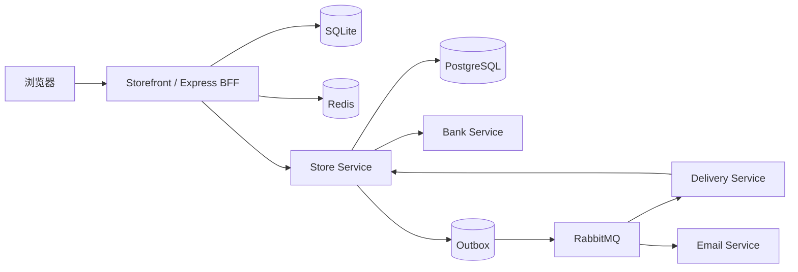

# Distributed Agent Commerce

分布式智能电商平台，由 Node.js 商城前台、BFF 与 Java 交易核心组成。系统将商品浏览、客服辅助与下单界面放在前台层，将报价、库存、订单、支付和履约放在交易核心。

## 系统组成

| 模块 | 职责 | 技术 |
| --- | --- | --- |
| Storefront | 商品目录、购物流程、秒杀、客服与管理界面 | Node.js 18+、Express、SQLite、Redis、JWT |
| Store | 商品、仓库库存、Checkout、订单、支付状态和 Outbox | Java 17、Spring Boot 3、JPA、PostgreSQL、Redis |
| Bank | 幂等支付查询、扣款与退款模拟 | Spring Boot、PostgreSQL |
| Delivery | 配送任务和状态回传模拟 | Spring Boot、RabbitMQ、PostgreSQL |
| Email | 订单通知消费与幂等记录 | Spring Boot、RabbitMQ、PostgreSQL |

## 核心业务流程

```text
商品浏览
  → 创建 Checkout
  → 生成报价
  → 用户确认
  → 提交订单并预留库存
  → 查询或发起支付
  → 写入履约与通知事件
  → RabbitMQ 投递到 Delivery / Email
```

Checkout 状态为 `DRAFT → QUOTED → CONFIRMED → COMPLETED`。更改商品或收货地址后，会回到 `DRAFT` 并清除旧报价与确认信息。报价有效期为 30 分钟；只有未过期的 `CONFIRMED` Checkout 才能提交。

## 已实现能力

- 多品类商品目录与前台购物界面。
- Checkout 报价、确认、过期与重复提交处理。
- PostgreSQL 事务与 JPA 乐观锁保护库存更新。
- 订单幂等键校验：相同请求可重放，不同请求复用同一键会被拒绝。
- `PAYMENT_PENDING` 支付处理与 `PaymentAttempt` 记录；远程结果不明时保持待确认状态。
- 未支付订单取消与库存释放，已支付未发货订单的退款记录。
- 事务 Outbox、RabbitMQ Publisher Confirm、未投递事件重试和消费端幂等处理。
- Redis Cache-Aside 商品/库存读取，数据库作为交易事实来源。
- Redis Lua 秒杀入口与 Stream 异步订单处理。
- 本地 FAQ 检索、商品/订单/优惠查询和可选的 OpenAI 兼容模型回复。
- WebSocket 订单状态通知。

## 架构



浏览器通过 Storefront BFF 访问交易能力。开启 `USE_TRADE_CORE=true` 时，商品和 Checkout 请求会转发到 Store；关闭时可使用 SQLite 运行独立的前台流程。

## 快速启动

### 完整系统

需要 Docker Desktop 和 Docker Compose。

```powershell
Copy-Item .env.example .env
# 编辑 .env，替换 DB_PASSWORD、MQ_PASSWORD、JWT_SECRET 和 STOREFRONT_JWT_SECRET
docker compose up -d --build
```

| 服务 | 地址 |
| --- | --- |
| Storefront | http://localhost:3001 |
| Store API | http://localhost:8080/api |
| RabbitMQ Management | http://localhost:15672 |

核心 React 调试界面默认不启动。需要时执行：

```powershell
docker compose --profile core-ui up -d
```

调试界面地址为 http://localhost:3000。

### 仅启动 Storefront

需要 Node.js 18+。Redis 不可用时，普通商品和本地订单功能仍可运行，秒杀功能不可用。

```powershell
Set-Location storefront
Copy-Item .env.example .env
npm install
npm run db:reset
npm start
```

Storefront 默认运行在 http://localhost:3000。

### 默认本地账号

| 界面 | 账号 | 密码 |
| --- | --- | --- |
| Storefront 买家 | `buyer@oldphonestore.demo` | `buyer123` |
| Storefront 管理员 | `admin@oldphonestore.demo` | `admin123` |
| Core 客户 | `customer` | `COMP5348` |
| Core 管理员 | `admin` | `admin123` |

上述账号只用于本地数据初始化，不应用于公网部署。

## 常用命令

```powershell
# 查看容器状态
docker compose ps

# 查看日志
docker compose logs -f store storefront bank delivery email

# 停止服务
docker compose down

# Java 测试与打包
Set-Location trade-core
.\gradlew.bat test bootJar

# 前台模块加载检查
Set-Location ..\storefront
node -e "require('./server/services/tradeCoreClient'); require('./server/routes/checkout'); require('./server/routes/products'); console.log('ok')"
```

## 配置

| 变量 | 用途 |
| --- | --- |
| `DB_NAME` / `DB_USER` / `DB_PASSWORD` | PostgreSQL 数据库配置 |
| `MQ_USER` / `MQ_PASSWORD` | RabbitMQ 账号 |
| `JWT_SECRET` | Store 身份令牌签名密钥 |
| `STOREFRONT_JWT_SECRET` | Storefront 身份令牌签名密钥 |
| `USE_TRADE_CORE` | Storefront 是否调用 Java 交易核心 |
| `TRADE_CORE_BASE_URL` | Store API 地址 |
| `TRADE_CORE_DEFAULT_USER_ID` | BFF 映射到核心的默认本地用户 ID |
| `REDIS_URL` | Storefront Redis 连接地址 |
| `LLM_PROVIDER` / `LLM_API_KEY` / `LLM_MODEL` | 可选的客服模型配置 |

## 当前边界

- Checkout 提交目前只支持单个 SKU；接口可接收的多行数据尚未转换为多行订单。
- Bank、Delivery 和 Email 是本地模拟服务，未接入真实支付、物流或邮件供应商。
- Storefront 的 FAQ 为本地关键词检索；商品、库存和订单数据由数据库查询提供。
- 根目录 Compose 面向本地单机环境，不包含生产集群、托管密钥、多节点 Redis 或完整可观测性配置。

## 仓库结构

```text
.
├── compose.yaml
├── .env.example
├── .github/workflows/ci.yml
├── storefront/          # Node.js 商城、BFF、SQLite 与 Redis
└── trade-core/         # Store / Bank / Delivery / Email 与核心调试 UI
```
