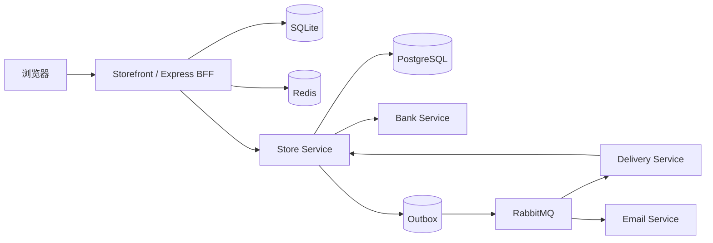

# Distributed Agent Commerce

分布式智能电商平台，由 Node.js 商城前台、BFF 与 Java 交易核心组成。系统将商品浏览、客服辅助与下单界面放在前台层，将报价、库存、订单、支付和履约放在交易核心。

## 系统组成

| 模块 | 职责 | 技术 |
| --- | --- | --- |
| Storefront | 商品目录、购物流程、秒杀、客服与管理界面 | Node.js 18+、Express、SQLite、Redis、JWT |
| Store | 商品、仓库库存、Checkout、订单、支付状态和 Outbox | Java 17、Spring Boot 3、JPA、PostgreSQL、Redis |
| Bank | 幂等支付查询、扣款与退款模拟 | Spring Boot、PostgreSQL |
| Delivery | 配送任务和状态回传模拟 | Spring Boot、RabbitMQ、PostgreSQL |
| Email | 订单通知消费与幂等记录 | Spring Boot、RabbitMQ、PostgreSQL |

## 核心业务流程

```text
商品浏览
  → 创建 Checkout
  → 生成报价
  → 用户确认
  → 提交订单并预留库存
  → 查询或发起支付
  → 写入履约与通知事件
  → RabbitMQ 投递到 Delivery / Email
```

Checkout 状态为 `DRAFT → QUOTED → CONFIRMED → COMPLETED`。更改商品或收货地址后，会回到 `DRAFT` 并清除旧报价与确认信息。报价有效期为 30 分钟；只有未过期的 `CONFIRMED` Checkout 才能提交。

## 已实现能力

- 多品类商品目录与前台购物界面。
- Checkout 报价、确认、过期与重复提交处理。
- PostgreSQL 事务与 JPA 乐观锁保护库存更新。
- 订单幂等键校验：相同请求可重放，不同请求复用同一键会被拒绝。
- `PAYMENT_PENDING` 支付处理与 `PaymentAttempt` 记录；远程结果不明时保持待确认状态。
- 未支付订单取消与库存释放，已支付未发货订单的退款记录。
- 事务 Outbox、RabbitMQ Publisher Confirm、未投递事件重试和消费端幂等处理。
- Redis Cache-Aside 商品/库存读取，数据库作为交易事实来源。
- Redis Lua 秒杀入口与 Stream 异步订单处理。
- 本地 FAQ 检索、商品/订单/优惠查询和可选的 OpenAI 兼容模型回复。
- WebSocket 订单状态通知。

## 架构



浏览器通过 Storefront BFF 访问交易能力。开启 `USE_TRADE_CORE=true` 时，商品和 Checkout 请求会转发到 Store；关闭时可使用 SQLite 运行独立的前台流程。

## 客服数据来源

前台正常启动不自动导入演示账号、商品或优惠。客服记忆表首次建立时为空，只由已登录用户的实际输入和真实工具返回写入；无历史时返回无记录，业务查询失败时返回不可用。测试样例仅用于独立临时数据库，不注入运行数据库。已有数据库中的演示数据不会自动删除，需要自行核实并处理。

`npm run seed` 是明确的演示数据导入命令，不属于正常启动步骤；真实使用时通过注册建立用户账号，商品由实际业务目录提供。Java Bank、Delivery、Email 仍是仓库既有模拟服务，四层记忆不将它们视为真实支付、物流或邮件供应商。

## 客服四层记忆

客服在原有 FAQ、商品查询、订单查询和会话选购条件上加入四层记忆。实施顺序见 [优化计划](CUSTOMER_MEMORY_PLAN.md)。以下能力已接入本地客服代码，首次访问长期记忆时自动建立 SQLite 表。

| 层 | 存储与职责 | 写入和读取规则 |
| --- | --- | --- |
| 工作记忆 | SQLite 对话记录、会话选购条件；Redis 缓存 | 最近 20 条、7 天对话窗口；选购条件沿用 24 小时有效期；会话归属校验，缓存失败回退 |
| 事实记忆 | FAQ 业务知识与 SQLite 用户偏好 | FAQ 保留来源版本；登录用户明确要求记住的选购属性跨会话复用，90 天有效；本轮明确条件优先 |
| 情景记忆 | SQLite 客服事件 | 保存商品查询、订单查询、政策答复的结果摘要和来源消息；按当前用户检索最近 5 条，90 天有效 |
| 程序型记忆 | 版本化 JSON SOP | 按意图选择允许的流程与工具；记录使用的 SOP ID、版本，流程不授予交易权限 |

读写流程：校验会话归属 → 读取会话条件与用户事实 → 识别意图并选择 SOP → 查询实时业务数据或政策 → 回复 → 保存消息及实际客服事件。用户事实仅提取明确给出的属性，不从模型回复、购买记录或临时预算推测长期偏好。

登录后可发送 `记住偏好：颜色黑色，容量256GB`、`查看我的记忆`、`忘记我的记忆`；`上次客服`、`上次的问题`、`历史客服`可查看自己跨会话的近期客服事件。游客仅使用会话上下文，不保存用户级长期记忆。清除命令删除长期事实和事件，并清空该账号现有会话选购条件；原始对话记录仍保留，清除不是全账号数据删除。长期数据按到期时间过滤，并在后续记忆访问时清理过期行。

订单状态、商品价格、库存始终以当前工具查询为准。历史事件只说明当时发生了什么；失败查询记为失败，政策答复不等于退款已执行。当前不提供自动退款 SOP、向量检索、模型自动记忆提取或真实供应商联调证明。

本地验证：`cd storefront` 后运行 `npm test`。记忆测试覆盖跨会话复用、数据库重开、用户隔离、90 天过期、旧轮次覆盖防护、清除后旧请求防回写、Redis 写入失败、订单指代实时查询和 SSE 中的 SOP 版本。单元测试使用临时 SQLite 与隔离的测试依赖；另有真实前台进程测试，通过 HTTP 注册用户、保存偏好、跨会话读取、查询空目录和不存在的订单并核验隔离与清除，全程不替换业务工具。Redis 在该进程测试中处于实际不可用状态，尚未验证真实模型或供应商联调。

## 快速启动

### 完整系统

需要 Docker Desktop 和 Docker Compose。

```powershell
Copy-Item .env.example .env
# 编辑 .env，替换 DB_PASSWORD、MQ_PASSWORD、JWT_SECRET 和 STOREFRONT_JWT_SECRET
docker compose up -d --build
```

| 服务 | 地址 |
| --- | --- |
| Storefront | http://localhost:3001 |
| Store API | http://localhost:8080/api |
| RabbitMQ Management | http://localhost:15672 |

核心 React 调试界面默认不启动。需要时执行：

```powershell
docker compose --profile core-ui up -d
```

调试界面地址为 http://localhost:3000。

### 仅启动 Storefront

需要 Node.js 18+。Redis 不可用时，普通商品和本地订单功能仍可运行，秒杀功能不可用。

```powershell
Set-Location storefront
Copy-Item .env.example .env
npm install
npm start
```

Storefront 默认运行在 http://localhost:3000。

### 默认本地账号

| 界面 | 账号 | 密码 |
| --- | --- | --- |
| Storefront 买家 | `buyer@oldphonestore.demo` | `buyer123` |
| Storefront 管理员 | `admin@oldphonestore.demo` | `admin123` |
| Core 客户 | `customer` | `COMP5348` |
| Core 管理员 | `admin` | `admin123` |

上述账号来自显式演示数据初始化，正常前台启动不会创建；不应用于公网部署。

首次核心结算时，先登录 Storefront，再在结算弹窗中用自己的 Core 账号关联。每个 Core 身份只能关联一个 Storefront 用户；令牌过期后重新登录同一 Core 账号。旧的 `user_id_map` 不作为身份凭据。填写收货地址、查看报价后确认；刷新或网络错误后点击“继续上次结算”使用原结算和原幂等键。

迁移范围与回退步骤见 [迁移记录](docs/MIGRATION_20261004.md)，接口契约见 [BFF](docs/TRADE_CORE_BFF.md) 和 [Checkout](docs/STAGE1_CHECKOUT.md)。

## 常用命令

```powershell
# 查看容器状态
docker compose ps

# 查看日志
docker compose logs -f store storefront bank delivery email

# 停止服务
docker compose down

# Java 测试与打包
Set-Location trade-core
.\gradlew.bat test bootJar

# 前台接口回归测试
Set-Location ..\storefront
npm test
```

## 配置

| 变量 | 用途 |
| --- | --- |
| `DB_NAME` / `DB_USER` / `DB_PASSWORD` | PostgreSQL 数据库配置 |
| `MQ_USER` / `MQ_PASSWORD` | RabbitMQ 账号 |
| `JWT_SECRET` | Store 身份令牌签名密钥 |
| `STOREFRONT_JWT_SECRET` | Storefront 身份令牌签名密钥 |
| `USE_TRADE_CORE` | Storefront 是否调用 Java 交易核心 |
| `TRADE_CORE_BASE_URL` | Store API 地址 |
| `CORE_TOKEN_ENCRYPTION_KEY` | BFF 加密核心令牌的独立密钥，至少 32 字节；未设时使用前台 JWT 密钥 |
| `TRADE_CORE_SKU_ID_EQUALS_FRONT` | 仅在已验证目录 ID 一致时开启；默认 false |
| `REDIS_URL` | Storefront Redis 连接地址 |
| `LLM_PROVIDER` / `LLM_API_KEY` / `LLM_MODEL` | 可选的客服模型配置 |

## 当前边界

- Checkout 支持 1–100 个不同 SKU，原子预留库存，快照价格与地址；BFF 要求显式关联核心账号并确认报价版本。
- 客服仍是关键词 FAQ 与只读查询加可选模型回复；未实现自主购物 Agent、向量 RAG 或模型准确率评测。
- 秒杀仍写入本地 SQLite，与核心订单流程独立；未迁移历史用户映射、订单或数据库卷。
- Bank、Delivery 和 Email 是本地模拟服务，未接入真实支付、物流或邮件供应商。
- Storefront 的 FAQ 为本地关键词检索；商品、库存和订单数据由数据库查询提供。
- 根目录 Compose 面向本地单机环境，不包含生产集群、托管密钥、多节点 Redis 或完整可观测性配置。

## 仓库结构

```text
.
├── compose.yaml
├── .env.example
├── .github/workflows/ci.yml
├── storefront/          # Node.js 商城、BFF、SQLite 与 Redis
└── trade-core/         # Store / Bank / Delivery / Email 与核心调试 UI
```

## 真实服务交易联调

准备根目录 `.env` 后，启动独立的联调 Compose 项目（数据卷与默认项目分开）：

```powershell
docker compose -p agent-commerce-integration up -d --build --wait --wait-timeout 300
node scripts/integration-smoke.cjs --local-demo
```

脚本会登录预置买家并关联 Core customer，选择两个商品，验证报价版本、订单快照、重复提交相同订单、错误键拒绝，然后等待实际配送回调将订单推进到 FULFILLED。每次执行会消耗模拟余额和库存，只用于独立演示环境；不要对已有业务数据运行。脚本输出结算和订单 ID，方便失败后追踪，不打印登录令牌或密码。

成功只证明交易至履约的 API 路径；邮件消费、故障注入和浏览器完整交互仍需分别验收。Docker 启动失败或脚本超时均不算通过。暂未在当前 Windows Docker 环境完成此验收。

```powershell
# 查看服务状态；按脚本输出的订单 ID 排查服务日志
docker compose -p agent-commerce-integration ps
docker compose -p agent-commerce-integration logs --tail 100 store bank delivery email
# 停止时保留数据卷
docker compose -p agent-commerce-integration down
```

启动依赖的环境变量由根 Compose 统一传入，不再要求额外创建 trade-core/.env。独立运行 trade-core 时仍应在该目录自行准备 .env，用于 Compose 变量插值。