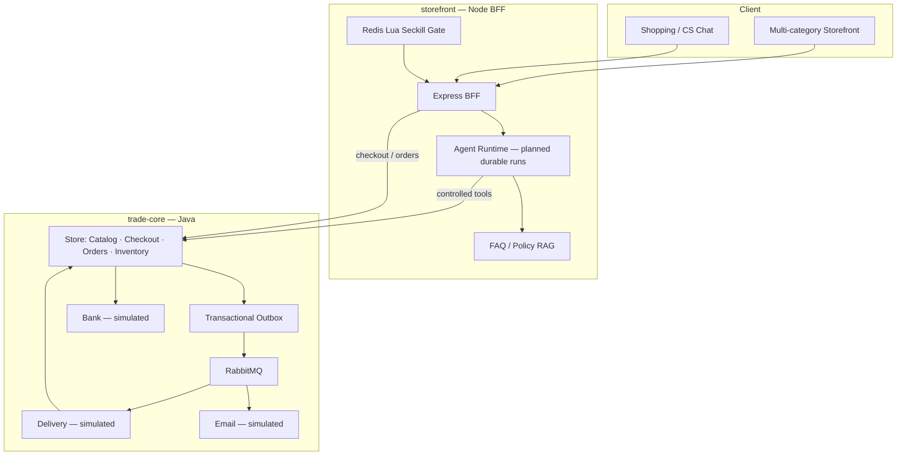

# Distributed Agent Commerce

**分布式智能 Agent 电商平台** — 确认式购物 + 可恢复的交易履约

[](./trade-core)
[](./trade-core)
[](./storefront)
[](./trade-core)
[](./trade-core)
[](./trade-core)
[](./trade-core/compose.yaml)
[](https://oldphonestore.onrender.com/)

用户可以在多品类商城选品、抢秒杀、和客服对话；**成交与履约不交给 LLM 自行扣款**，而是经 **Checkout Session（报价 → 确认 → 提交）** 进入 Java 交易核心，由库存预留、支付尝试与 Outbox 完成可验证、可恢复的链路。

> **不是**「LLM + 直接调 `/createOrder`」。  
> **是** Agent / 前台组织意图 → BFF → Trade Core 裁定金额与库存 → 模拟支付 / 配送 / 通知，并覆盖超时与重启恢复。

| | |
| --- | --- |
| **Storefront demo** | https://oldphonestore.onrender.com/ （独立前台；冷启动可能较慢） |
| **Architecture baseline** | [MIDDLE_PLATFORM_MERGE_PLAN.md](./MIDDLE_PLATFORM_MERGE_PLAN.md) |
| **Origin** | Evolved from [distributed-ecommerce-platform](https://github.com/kikiarya/distributed-ecommerce-platform) + [OldPhoneStore](https://github.com/kikiarya/OldPhoneStore) |

---

## Why this project

| 常见作品集做法 | 本项目的选择 |
| --- | --- |
| Agent 直接下单扣款 | **必须先确认报价版本**；改价 / 改地址会使确认失效 |
| 聊天 Demo 与交易系统两张皮 | 同一条业务链路：选品 → Checkout → 支付 → Outbox → 查单 |
| 只演示「下单成功」 | 可演示 **支付 UNKNOWN、停 MQ、同幂等键恢复、未发货取消→退款** |
| 堆 Multi-Agent / MCP 名词 | V1 **单 Agent + 明确工具契约**；多 Agent 后置 |
| 假装已接真实支付 | Bank / Delivery / Email 为**可注入故障的模拟适配器**；状态机是真的 |

面试时你可以讲清：

- 为什么不能让 Agent 直接下单？  
- Checkout `QUOTED → CONFIRMED → complete` 如何防误扣？  
- 支付超时为什么**不能**立刻回补库存？  
- Outbox 如何解决「DB 已提交、MQ 未发出」？  
- RAG 为什么不能回答实时库存？  

---

## Features

### Trade Core（`trade-core/`）

- **微服务拆分** — Store / Bank / Delivery / Email，PostgreSQL schema 隔离  
- **Checkout Session** — `DRAFT → QUOTED → CONFIRMED → COMPLETED`；报价不占库存，提交时预留  
- **支付可恢复** — `PaymentAttempt` + Bank `pay` / `query`；`UNKNOWN` 保持预留，由 Reconciler 收敛  
- **Transactional Outbox** — 与业务同事务写入；Publisher Confirm、重试、DLQ  
- **取消与退款** — 未支付取消释放库存；已支付未发货取消进入退款流（不做已发货退货）  
- **故障可演** — `bankMock=fail|timeout`、停 RabbitMQ 看 Outbox 积压再续传  

### Storefront + BFF（`storefront/`）

- **多品类目录** — 数码 / 图书 / 家居 / 二手单件样例（不绑死二手手机）  
- **BFF** — `USE_TRADE_CORE=true` 时走核心 Checkout；浏览器不直连写接口  
- **Redis 秒杀** — Lua 原子扣减 + Stream 异步落单（边缘闸门）  
- **智能客服** — FAQ RAG + Tool Calling；可选 OpenAI / DeepSeek / Kimi  
- **独立演示** — Render 可单独起前台；接核心用本机 Compose 双栈  

---

## Architecture



**成交主路径（阶段 1 已通）：**

```text
create checkout → quote → confirm → complete
       → Order(PAYMENT_PENDING) + stock hold + PaymentAttempt
       → Bank.pay / query(paymentAttemptId)
       → PAID | FAILED | stay PENDING (never release on UNKNOWN)
```

---

## Tech Stack

| Layer | Stack |
| --- | --- |
| Trade Core | Java 17 · Spring Boot 3 · JPA · Redis Cache-Aside · RabbitMQ · gRPC · Gradle · Docker Compose |
| Storefront | Node 18+ · Express · SQLite · Redis · JWT · Lua / Stream · vanilla storefront |
| Data | PostgreSQL 16（核心）· SQLite（前台投影 / 本地演示） |
| Ops | Docker Compose · GitHub Actions（核心仓） |

---

## Quick Start

### Option A — Umbrella Compose（推荐演示）

一条命令起 **交易核心 + Agent 前台**（前台映射到 **:3001**，避免和核心调试 UI 抢端口）：

```powershell
Copy-Item .env.example .env
# 编辑 .env：填写 DB_PASSWORD、MQ_PASSWORD、JWT_SECRET（≥32 字符）

docker compose up -d --build
```

| | URL |
| --- | --- |
| **Agent 商城** | http://localhost:3001 |
| Trade Core API | http://localhost:8080/api |
| RabbitMQ | http://localhost:15672 |
| 核心 React 调试台（可选） | `docker compose --profile core-ui up -d` → http://localhost:3000 |

Buyer：`buyer@oldphonestore.demo` / `buyer123`（首次启动会 seed）

### Option B — 分目录启动

#### 1) Trade Core

```powershell
cd trade-core
Copy-Item .env.example .env
# 填写 DB_PASSWORD、MQ_PASSWORD、JWT_SECRET（≥ 32 字节）
docker compose up -d --build
```

| | URL / Account |
| --- | --- |
| Store API | http://localhost:8080/api |
| Core UI (debug) | http://localhost:3000 （compose 内 React） |
| Customer | `customer` / `COMP5348` |
| RabbitMQ | http://localhost:15672 |

更多：[`trade-core/README.md`](./trade-core/README.md) · [`docs/STAGE1_CHECKOUT.md`](./docs/STAGE1_CHECKOUT.md)

#### 2) Storefront BFF

```powershell
cd storefront
Copy-Item .env.example .env
```

```env
USE_TRADE_CORE=true
TRADE_CORE_BASE_URL=http://127.0.0.1:8080
TRADE_CORE_DEFAULT_USER_ID=1
TRADE_CORE_SKU_ID_EQUALS_FRONT=true
```

```powershell
npm install
npm run db:reset
npm start
```

| | |
| --- | --- |
| Storefront | http://localhost:3000 （若与核心 UI 冲突，设 `PORT=3001`） |
| Buyer | `buyer@oldphonestore.demo` / `buyer123` |
| Admin | `admin@oldphonestore.demo` / `admin123` |

> `USE_TRADE_CORE=false` 时前台可独立本地闭环（不宣称已接核心）。

### CI

Push / PR 会跑根目录 [`.github/workflows/ci.yml`](./.github/workflows/ci.yml)：

- `trade-core`：`./gradlew test bootJar`
- `trade-core/frontend`：`npm run build`
- `storefront`：依赖安装 + 模块加载冒烟
---

## Repository Layout

```text
.
├── README.md
├── compose.yaml                    # Umbrella：核心 + storefront（:3001）
├── .env.example
├── .github/workflows/ci.yml        # Monorepo CI
├── MIDDLE_PLATFORM_MERGE_PLAN.md
├── docs/
├── trade-core/
└── storefront/
```

---

## Status / Roadmap

诚实进度（简历勿超前宣称）：

| Stage | Scope | Status |
| --- | --- | --- |
| 0 | 契约与 Hard Decisions 冻结 | Done（文档） |
| 1 | 单 SKU：Checkout → 支付恢复 → 取消/退款；BFF 对接 | **In progress / demoable** |
| 2 | 多行订单 + 运营写核心 | Planned |
| 3 | 购物 Agent Runtime（确认式工具 + RAG + 评测） | Planned |
| 4 | 秒杀额度隔离与对账 | Planned |
| 5 | 售后扩展 / 外部协议适配 | Later — **不宣称 ACP/UCP 兼容** |

---

## What you can demo in an interview

1. **Confirm-gated checkout** — 未 `confirm` 不能 `complete`  
2. **Payment UNKNOWN** — `bankMock=timeout` 后订单保持处理中，库存不误释放；恢复后到终态  
3. **Outbox** — 停 RabbitMQ 下单，积压后续传  
4. **Idempotency** — 同键重放不双扣；异指纹冲突拒绝  
5. **Cancel** — 已支付未发货取消 → 核心退款记录  
6. **Storefront BFF** — 浏览器只打 Node；核心写接口需用户身份  
7. **Seckill / Chat** — 前台 Redis 秒杀与 RAG 客服（可独立演示）  

---

## Documentation

| Doc | Description |
| --- | --- |
| [MIDDLE_PLATFORM_MERGE_PLAN.md](./MIDDLE_PLATFORM_MERGE_PLAN.md) | 完整 V1 基线：状态机、工具契约、评测、V2 多 Agent 草案 |
| [docs/STAGE1_CHECKOUT.md](./docs/STAGE1_CHECKOUT.md) | Checkout HTTP 契约 |
| [docs/TRADE_CORE_BFF.md](./docs/TRADE_CORE_BFF.md) | 前台开关与映射 |
| [trade-core/README.md](./trade-core/README.md) | 核心服务端口、故障注入、CI |
| [storefront/README.md](./storefront/README.md) | 前台模块与 Render 部署 |

---

## License

子目录保留原项目 License（见 `trade-core/`、`storefront/`）。本 monorepo 用于学习与作品集演示。
