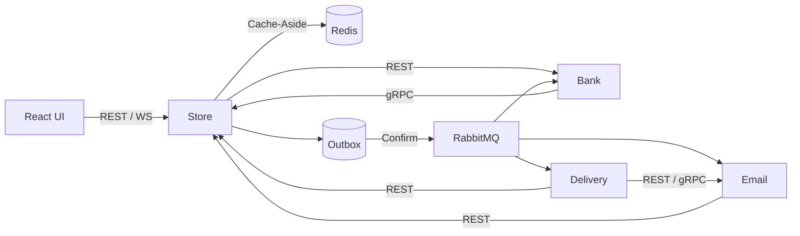

# Distributed E-Commerce Platform

**微服务电商全链路**：下单 → 支付 → 多仓库存 → 配送 → 退款 → 实时通知。

Spring Boot 拆成 4 个独立服务，用 **Transactional Outbox + RabbitMQ + 幂等 / 去重** 扛住超时、重复投递和部分失败；Redis Cache-Aside 加速读路径；React 商城 + 运营台，**一条 `docker compose` 拉起整栈**。

## Stage 1 (Checkout Session)

See [docs/STAGE1_CHECKOUT.md](./docs/STAGE1_CHECKOUT.md) for `quote → confirm → complete`, Bank `query`, and cancel/refund rules.

| 亮点 | 你实际能看到的 |
| --- | --- |
| **服务拆分** | Store / Bank / Delivery / Email，schema 隔离，REST + gRPC + MQ 协作 |
| **钱与库存不乱** | 支付幂等键、乐观锁防超卖、失败自动回补、待支付后台恢复 |
| **消息可靠投递** | Outbox 与业务同事务提交，Publisher Confirm，重试 + DLQ |
| **重复不怕** | 运单 / 邮件消费去重，取消与退款可安全重放 |
| **读性能** | Redis 缓存商品 / 仓库 / 库存视图，写后失效，Redis 挂了仍回源 DB |
| **可演示故障** | 支付失败 / 超时注入、停 MQ 看 Outbox 堆积再续传、可配置丢件退款 |
| **工程化** | Gradle 多模块、回归测试、GitHub Actions CI、Docker 一键部署 |

## Architecture



| Service | Responsibility | Port |
| --- | --- | --- |
| **store** | 商品 · 订单 · 库存 · Outbox · WebSocket | `8080` / gRPC `9090` |
| **bank** | 账户 · 支付 · 退款 | `8081` |
| **delivery** | 运单创建与状态推进 | `8082` |
| **email** | 通知落库与配送回调 | `8083` / gRPC `9091` |
| **frontend** | 商城 + 运营台（Nginx 反代 API/WS） | `3000` |
| **infra** | PostgreSQL · Redis · RabbitMQ | `5432` / `6379` / `5672` |

## Features

- **商城闭环** — 浏览、下单、查单、发货前取消  
- **智能分仓** — 能单仓就单仓，不够再跨仓拼货  
- **支付链路** — 独立 Bank 服务；成功 / 失败 / 超时三条路径都有明确收场  
- **异步履约** — 配送与通知走 MQ，页面 WebSocket 实时刷状态  
- **取消退款** — 锁单回补库存，异步退款，重复取消不二次打款  
- **可靠性套件** — Outbox · Confirm · 有限重试 · DLQ · 幂等键 · 消费去重  

### Order flow

1. 本地事务预留库存 → `PAYMENT_PENDING`  
2. 调用 Bank（**同一订单固定幂等键**）  
3. 成功 → `PAID` + 写入 Outbox；失败 → `FAILED` + 回补库存  
4. 结果未知 → 后台用同一幂等键恢复，不瞎判失败  

### Messaging

业务状态与 Outbox **同事务提交**；后台投递并等待 Confirm。消费失败退避重试，耗尽进 DLQ；重复消息靠业务去重消化。

| Queue | DLQ |
| --- | --- |
| `delivery-request-queue` | `delivery-request-dlq` |
| `refund-request-queue` | `refund-request-dlq` |
| `email-notification-queue` | `email-notification-dlq` |

### Redis Cache-Aside

| Data | TTL | Invalidate |
| --- | --- | --- |
| Products / warehouses | 10 min | 写提交后 |
| Stock views | 15 s | 预留 / 回补后 |

**库存真相在 PostgreSQL**（事务 + `@Version`）；缓存只加速展示，旧缓存不会直接超卖。

## Tech Stack

`Java 17` · `Spring Boot 3` · `Spring Data JPA` · `Spring Data Redis` · `Spring AMQP` · `gRPC / Protobuf` · `PostgreSQL 16` · `Redis 7` · `RabbitMQ` · `React 18` · `Gradle` · `Docker Compose` · `GitHub Actions`

## Quick Start

```powershell
Copy-Item .env.example .env
# 填写 DB_PASSWORD、MQ_PASSWORD、JWT_SECRET（≥ 32 字节）
docker compose up -d --build
```

| | |
| --- | --- |
| 商城 | http://localhost:3000 |
| API | http://localhost:8080/api |
| RabbitMQ | http://localhost:15672 |

| Role | User | Password |
| --- | --- | --- |
| Customer | `customer` | `COMP5348` |
| Admin | `admin` | `admin123` |

```powershell
docker compose logs -f store
docker compose down        # 保留数据
docker compose down -v     # 清空重来
```

### Dev mode（本机跑服务）

```powershell
docker compose up -d --wait postgres rabbitmq redis
.\scripts\start-service.ps1 bank
.\scripts\start-service.ps1 email
.\scripts\start-service.ps1 store
.\scripts\start-service.ps1 delivery
cd frontend; npm ci; npm start
```

## Reliability demos

这些不是「彩蛋」，是系统刻意暴露的故障注入能力：

1. **快乐路径** — 下单 → 支付成功 → 配送状态一路推到完成，WS 实时刷新  
2. **取消退款** — 发货前取消，库存回来、Bank 退款、通知落库  
3. **幂等** — 同一 `Idempotency-Key` 重放，订单与扣款不翻倍  
4. **支付失败** — `POST /api/orders?bankMock=fail` → 订单失败 + 库存回补  
5. **支付超时** — `bankMock=timeout` → 待支付恢复，最终与 Bank 对齐  
6. **Broker 中断** — 停 RabbitMQ 再下单，看 Outbox 堆积；拉起 MQ 后自动续传  
7. **丢件** — `.env` 设 `DELIVERY_LOSS_RATE`，走丢件 → 退款链路  

## Build & CI

```powershell
.\gradlew.bat test bootJar
cd frontend; npm run build
```

Push 即跑 [GitHub Actions](.github/workflows/ci.yml)：后端测试 + 打包，前端 production build。

## Layout

```text
├── store/       商城核心 · 库存 · Outbox · WebSocket
├── bank/        支付与退款
├── delivery/    运单引擎
├── email/       通知与回调
├── common/      Protobuf 共享契约
├── frontend/    React + Nginx
├── scripts/     本地一键启动
├── docs/        联调与验证笔记
├── Dockerfile   多阶段构建 Java 服务
└── compose.yaml 全栈 / 仅基础设施
```
